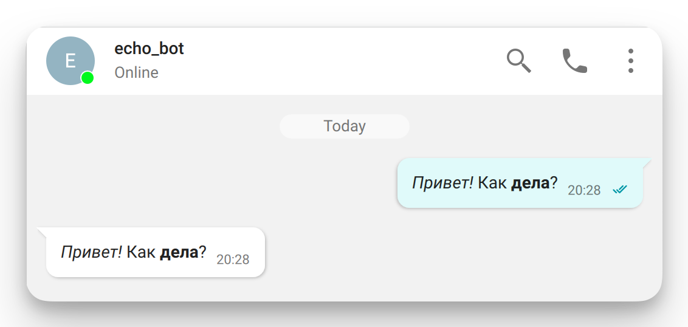
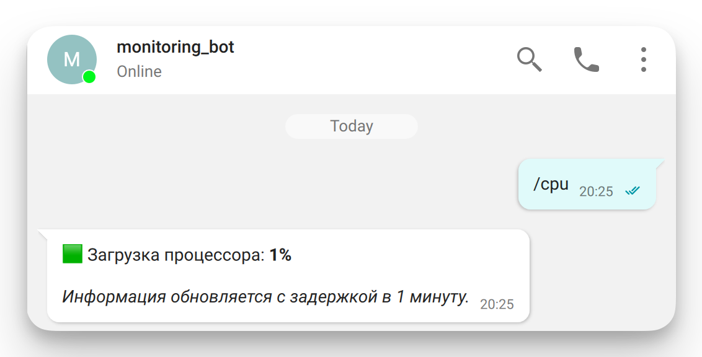
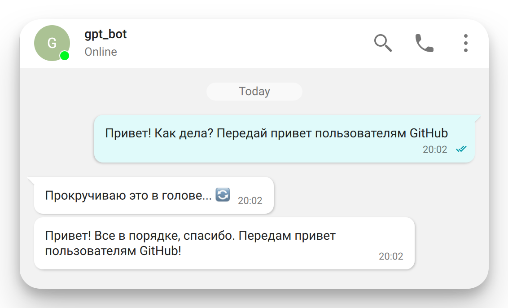
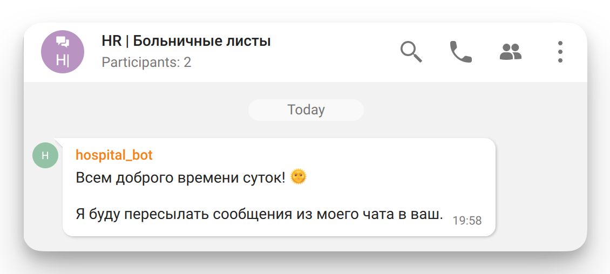

<p align="center">
  <a href="https://trueconf.ru" target="_blank" rel="noopener noreferrer">
    <picture>
      <source media="(prefers-color-scheme: dark)" srcset="assets/logo-cyrillic.svg" type="image/svg">
      
    </picture>
  </a>
</p>

<h1 align="center">Демонстрация работы чат-ботов в TrueConf Server</h1>

<p align="center">
     <a href="https://pypi.org/project/python-trueconf-bot" target="_blank">
      
</a>
    <a href="https://t.me/trueconf_chat" target="_blank">
        
    </a>
</p>

<p align="center">
  <a href="README-ru.md">English</a> /
  <a href="./README-ru.md">Русский</a>
</p>

## Введение

В этом проекте представлены примеры чат-боты, для демонстрации интеграции TrueConf ChatBot Connector с корпоративной системой видеосвязи TrueConf Server. 
Каждый бот выполняет конкретную задачу — от мониторинга состояния сервера до работы с локальными LLM-моделями, имитируя возможности ChatGPT и аналогичных ИИ-сервисов.

Боты легко адаптируются под закрытую инфраструктуру и отлично вписываются в концепцию TrueConf Server — автономного решения для защищённых сетей.

Основные возможности:
- 💬 Эхо-бот — простой пример обработки входящих сообщений, служит шаблоном для разработки пользовательских сценариев.
- 🏥 Больничный бот — принимает сообщения сотрудников в групповом чате и автоматически пересылает их в чат HR, фиксируя отправителя и содержание.
- 📊 Мониторинг-бот — отслеживает ключевые метрики TrueConf Server через API, уведомляет об изменениях и позволяет быстро реагировать на инциденты.
- 🤖 GPT-бот — работает с локальной LLM-моделью (в формате GGUF), не требует подключения к интернету и может использоваться в изолированных средах.
- ⚙️ Гибкая конфигурация — все параметры управляются через config.toml, включая настройки серверов, пользователей и моделей.
- 🌐 Поддержка локализации — боты могут отвечать на разных языках, включая русский, английский и любые добавленные вручную.

Боты запускаются как единый процесс и могут быть включены/отключены через конфигурацию. Архитектура проекта позволяет расширять функциональность, подключать новые модули и адаптировать поведение под нужды вашей организации.

## Структура проекта

Для удобства разработки проект разделён на логические модули.

```
app/
├── bots/
│   ├── _echo_bot.py           # Эхо-бот: отвечает тем же сообщением
│   ├── _gpt_bot.py            # Бот на основе GPT (ИИ)
│   ├── _hospital_bot.py       # Бот для автоматизации больничных
│   ├── _monitoring_bot.py     # Бот для мониторинга сервера
│   ├── init.py                # Инициализация пакета bots
│   ├── config.py              # Конфигуратор модели Pydantic
│   └── utils.py               # Вспомогательные функции
│  
config.toml                    # Конфигурационные константы проекта  
main.py                        # Главная точка входа: запуск всех ботов
```

## Конфигурация 

Константы, используемые в проекте, определены в файле [config.toml](config.toml). 
Формат конфигурации — [TOML](https://toml.io/), удобный для хранения структурированных данных.
В этом разделе описаны глобальные параметры, общие для всех ботов. Настройки для конкретных ботов смотрите в соответствующих разделах.

**Пример:**

```toml
bots_language = "ru" # Язык ответов ботов
server_address = "10.140.0.33" # IP-адрес (FQDN) TrueConf Server
```

> [!CAUTION] Внимание
> Изменять названия параметров **запрещено**, так как они напрямую используются в коде. Допускается изменение **только** значений.

### Преобразование конфигурации

При запуске проекта специальный конфигуратор автоматически конвертирует [`config.toml`](config.toml) в файл `config_models.py` с объектами Pydantic.

> [!WARNING] Важно
> Файл `config_models.py` необходимо удалять вручную, если в [`config.toml`](config.toml) были добавлены новые параметры — иначе изменения не будут применены.

### Локализация

Проект поддерживает интернационализацию — боты могут отвечать на заданном языке.
По умолчанию используется английский (en).

Если вы хотите добавить новый язык:

1. Скопируйте файл [`app/locales/en.yml`](app/locales/en.yml) в новый файл, например `de.yml`.
2. Переведите строки внутри нового файла.
3. Укажите код нового языка в параметре `bots_language` в [`config.toml`](config.toml).

Вы также можете редактировать строки в существующих языковых файлах, чтобы изменить формулировки по умолчанию.

## Настройка ботов

### Эхо-бот

Для работы бота требуется отдельная учётная запись на TrueConf Server. 
Создайте её через панель управления, например с именем `echo_bot`, и укажите соответствующий логин и пароль в конфигурационном файле:

```toml
[echo_bot]
username = "echo_bot"
password = "verystrongpassword"
```

<p align="center">
    
</p>

> [!NOTE]
> Бот отвечает тем же сообщением, которое получил от пользователя. Удобен для тестирования подключения и отладки.

### Бот мониторинга сервера

Для работы бота требуется отдельная учётная запись на TrueConf Server. 
Создайте её через панель управления, например с именем `monitoring_bot`, и укажите соответствующий логин и пароль в конфигурационном файле:

```toml
[monitoring_bot]
username = "monitoring_bot"
password = "verystrongpassword"
```

<p align="center">
    
</p>

#### OAuth-доступ к статистике

Поскольку бот обращается к статистике сервера через API, необходимо:

1. Создать OAuth-приложение в панели управления TrueConf Server с правами:
  - `statistics:read`;
  - `server.license:read`.

2. Скопировать `client_id` и `client_secret` и вставить их в конфигурационный файл:

```toml
[monitoring_bot]
client_id = "your_client_id"
client_secret = "your_client_secret"
```

> [!NOTE]
> Вам не нужно самостоятельно получать `access_token`. 
> Скрипт автоматически запрашивает и обновляет токен при каждом обращении бота к серверу.

### Больничный-бот

Для работы бота требуется отдельная учётная запись на TrueConf Server. 
Создайте её через панель управления, например с именем `hospital_bot`, и укажите соответствующий логин и пароль в конфигурационном файле:

```toml
[hospital_bot]
username = "hospital_bot"
password = "verystrongpassword"
```

### GPT-бот

Для работы бота требуется отдельная учётная запись на TrueConf Server. 
Создайте её через панель управления, например с именем `gpt_bot`, и укажите соответствующий логин и пароль в конфигурационном файле:

```toml
[gpt_bot]
username = "gpt_bot"
password = "verystrongpassword"
```

<p align="center">
    
</p>

#### Использование локальной LLM-модели

Бот `gpt_bot` работает с локальной LLM-моделью (например, LLaMA, Mistral и др.) через библиотеку [llama-cpp-python](https://github.com/abetlen/llama-cpp-python).
Модель запускается на вашей машине — локально, на CPU или GPU, без подключения к облачным сервисам.

Это позволяет:

- Создавать функциональность, аналогичную ChatGPT, Claude, Gemini, DeepSeek и другим, **внутри закрытой системы**;
- Обеспечить **максимальную приватность данных** — ни один запрос не покидает локальную сеть;
- Развернуть ИИ-бота в **офлайн-среде или полностью изолированной инфраструктуре**;
- Интегрировать ИИ в корпоративные системы, в том числе **на базе TrueConf Server**, который также рассчитан на работу в изолированных (on-premise) сетях.

> [!TIP]
> Такой подход идеально подходит для предприятий, государственных структур, ВПК, образовательных и медицинских учреждений, где **внешние API и облачные LLM запрещены** по требованиям безопасности.

#### Настройка LLM-модели

Для работы `gpt_bot` с локальной LLM-моделью (например, LLaMA или аналогами на GGUF) необходимо настроить параметры в секции `[gpt_bot.llama]` конфигурационного файла.

1. **Параметры модели**. В секции `[gpt_bot.llama]` задаются ключевые параметры модели:
  
  ```toml
  [gpt_bot.llama]
  repo_id = "Qwen/Qwen2.5-7B-Instruct-GGUF"
  filename = "qwen2.5-7b-instruct-q3_k_m.gguf"
  ```

- `repo_id` — идентификатор модели на [Hugging Face](https://huggingface.co/), например, `Qwen/Qwen2.5-7B-Instruct-GGUF`.
- `filename` — имя файла модели в формате **.gguf**, который необходимо скачать из репозитория модели.

2. **Локальное хранение модели**

  ```toml
  [gpt_bot.llama]
  local_dir = "/path/to/models"
  ```

- `local_dir` — путь к папке на локальной машине, куда будет загружена модель при первом запуске. 
После первой загрузки модель сохраняется в эту директорию и повторно скачиваться не будет. Это позволяет запускать бота без постоянного подключения к интернету.

3. **Настройка токенов**

  ```toml
  [gpt_bot.llama]
  n_ctx = 2048
  max_tokens = 512
  ```
- `n_ctx` — максимальное количество входных токенов, т.е. размер окна контекста (контекстная длина).
- `max_tokens` — максимальное число токенов, которое модель может сгенерировать в ответ.

> [!TIP]
> Увеличение значения `n_ctx` позволяет учитывать более длинные сообщения в контексте, но требует больше ресурсов.
> Значение `max_tokens` напрямую влияет на длину ответа и также может влиять на производительность.

4. **Использование GPU**

  ```toml
  [gpt_bot.llama]
  n_gpu_layers = -1
  ```

`n_gpu_layers` — количество слоёв модели, которые будут выполняться на GPU (если доступна). Значения:
- `-1` — использовать все возможные слои на GPU (рекомендуется, если у вас достаточно видеопамяти).
- `0` — отключить использование GPU (вся модель будет работать на CPU).
- `>0` — использовать только указанное число слоёв на GPU, остальные — на CPU (можно использовать при ограниченной видеопамяти).

> [!TIP]
> Значение `-1` подходит для систем с мощной видеокартой (8 ГБ+ VRAM).
> Если возникают ошибки загрузки модели или нехватки памяти — попробуйте снизить значение до 16, 8, 4 или даже 0.

💡 **Теперь полная структура секции `[gpt_bot.llama]` выглядит так:**

```toml
[gpt_bot.llama]
repo_id = "Qwen/Qwen2.5-7B-Instruct-GGUF"
filename = "qwen2.5-7b-instruct-q3_k_m.gguf"
local_dir = "/path/to/models"
n_ctx = 2048
max_tokens = 512
n_gpu_layers = -1
```

## Настройка окружения

### Зависимости

Для запуска проекта на рабочей машине должны быть установлены:

* **Python** — протестировано на версии 3.13.2. Совместимо с версиями 3.10 и выше.
* **Pipenv** — менеджер виртуальных сред и зависимостей. Установка:

    ```shell
    pip install pipenv
    ```

### Установка зависимостей проекта

После установки `pipenv` перейдите в директорию проекта и выполните:

```shell
pipenv install
```

Это установит все зависимости, указанные в [Pipfile](Pipfile), включая библиотеку `llama-cpp-python`, используемую ботом `gpt_bot` для запуска локальных LLM-моделей. 
При установке пакета `llama-cpp-python` происходит его сборка из исходников, поэтому для корректной работы требуется наличие C-компилятора в системе (либо воспользуйтесь установкой через готовые колёса):

- **Linux** — `gcc` или `clang` (в большинстве дистрибутивов `gcc` установлен по умолчанию);
- **Windows** — Visual Studio или MSYS2.
- **macOS** — Xcode (доступен в [AppStore](https://apps.apple.com/us/app/xcode/id497799835))

#### ⚡ Установка готового колеса `llama-cpp-python` (.whl)

##### Для работы на CPU

Если вам не требуется GPU-поддержка и вы готовы использовать CPU-only версию, можно установить заранее собранный пакет:

1. Сначала установите `llama-cpp-python`: 

```shell
pipenv run pip install llama-cpp-python --extra-index-url https://abetlen.github.io/llama-cpp-python/whl/cpu
```

2. Потом установите оставшиеся пакеты привычным способом:

```shell
pipenv install
```

> [!NOTE]
> Этот способ подходит для быстрого старта и тестов. Производительность будет ниже, чем у GPU-версии.

##### Для работы на GPU (CUDA, Metal)

###### CUDA

Требования:

- версия CUDA — 12.1, 12.2, 12.3, 12.4 или 12.5
- версия Python — 3.10, 3.11 или 3.12

```shell
pipenv run pip install llama-cpp-python --extra-index-url https://abetlen.github.io/llama-cpp-python/whl/<cuda-version>
```

Где `<cuda-version>` один из следующих вариантов:

- cu121: CUDA 12.1
- cu122: CUDA 12.2
- cu123: CUDA 12.3
- cu124: CUDA 12.4
- cu125: CUDA 12.5

Например, установка для CUDA 12.1:

```shell
pipenv run pip install llama-cpp-python --extra-index-url https://abetlen.github.io/llama-cpp-python/whl/cu121
```

Затем установите прочие зависимости:

```shell
pipenv install
```

###### Metal (macOS)

Требования:

- macOS 11.0 или позднее;
- Python 3.10, 3.11 или 3.12.

```shell
pip install llama-cpp-python extra-index-url https://abetlen.github.io/llama-cpp-python/whl/metal
```

#### 🔧 Ручная сборка для других GPU-бэкендов

Если у вас другой GPU-бэкенд (например, AMD ROCm) или установка на Windows не прошла, соберите пакет вручную.

> [!TIP]
> Ознакомьтесь с поддерживаемыми бэкендами в [официальном репозитории](https://github.com/abetlen/llama-cpp-python).

1. Установите [MSYS2](https://www.msys2.org/) в директорию по умолчанию `C:\msys64`.
2. Запустите терминал **MSYS2 UCRT64**.
3. Установите пакеты:

  ```shell
  pacman -S mingw-w64-ucrt-x86_64-toolchain mingw-w64-ucrt-x86_64-cmake mingw-w64-ucrt-x86_64-make git mingw-w64-ucrt-x86_64-python mingw-w64-ucrt-x86_64-python-pip
  ```

  > [!NOTE]
  > Если вы столкнулись с недоступностью пакетов (`error: failed retrieving file from repo.msys2.org`), то воспользуйтесь инструментом по смене IP-адреса.

4. Проверьте наличие и версии инструментов:

  ```shell
  gcc --version
  cmake --version
  git --version
  python --version
  pip --version
  ```

5. Сборка `llama-cpp-python` с поддержкой AMD ROCm (hipBLAS): 

```shell
pipenv run CMAKE_ARGS="-DGGML_HIPBLAS=on" pip install llama-cpp-python
```

6. Затем установите остальные зависимости:

```shell
pipenv install
```

## Запуск

После настройки конфигурации, окружения и установки зависимостей можно перейти к запуску проекта. Для запуска ботов выполните команду:

```shell
pipenv run python main.py

```

> [!TIP] При первом запуске
> 1. Специальный конфигуратор создаст файл `config_models.py` необходимый для работы проекта. Удалять его не нужно!
> 2. Начнется загрузка модели с Hugging Face. После этого будут запущены боты. При последующих запусках они будут запускаться сразу.

#### Добавление больничного бота в чат

Для корректной работы бота его необходимо **добавить в групповой чат**.
При первом добавлении бот автоматически сохранит `chat_id` и `chat_name` в конфигурации и отправит приветственное сообщение.

<p align="center">
    
</p>

> [!CAUTION]
> После добавления **не добавляйте бота в другие групповые чаты** — это сбросит текущую привязку, и бот начнёт пересылать сообщения в новый чат.
> При необходимости вы можете доработать этот механизм самостоятельно, форкнув репозиторий проекта.
