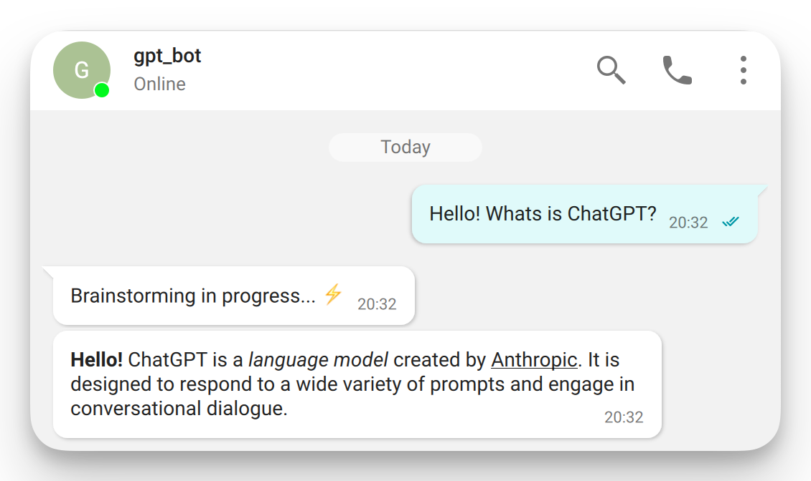

<p align="center">
  <a href="https://trueconf.ru" target="_blank" rel="noopener noreferrer">
    <picture>
      <source media="(prefers-color-scheme: dark)" srcset="assets/logo.svg" type="image/svg">
      
    </picture>
  </a>
</p>

<h1 align="center">Demonstration of Chatbot Functionality in TrueConf Server</h1>

<p align="center">
     <a href="https://pypi.org/project/python-trueconf-bot" target="_blank">
      
</a>
    <a href="https://t.me/trueconf_chat" target="_blank">
        
    </a>
</p>

<p align="center">
  <a href="README-ru.md">English</a> /
  <a href="./README-ru.md">Русский</a>
</p>

## Introduction

This project provides example chatbots that demonstrate the integration of TrueConf ChatBot Connector with the corporate video conferencing system TrueConf Server. Each bot is designed for a specific task — from monitoring server status to working with local LLM models, simulating the capabilities of ChatGPT and similar AI services.

The bots are easy to adapt to closed infrastructures and perfectly align with the concept of TrueConf Server — an autonomous solution for secure networks.

Key features:

* 💬 Echo Bot — a simple example of handling incoming messages, serving as a template for building custom scenarios.
* 🏥 Sick Leave Bot — collects employees’ messages in a group chat and automatically forwards them to the HR chat, preserving sender info and content.
* 📊 Monitoring Bot — tracks key TrueConf Server metrics via API, sends alerts on changes, and enables fast response to incidents.
* 🤖 GPT Bot — works with a local LLM model (in GGUF format), does not require internet access, and can be deployed in isolated environments.
* ⚙️ Flexible Configuration — all parameters are managed through `config.toml`, including servers, users, and models.
* 🌐 Localization Support — bots can reply in different languages, including Russian, English, and any manually added ones.

The bots run as a single process and can be enabled/disabled through configuration. The project’s architecture allows extending functionality, connecting new modules, and tailoring behavior to your organization’s needs.

## Project Structure

For easier development, the project is divided into logical modules.

```
app/
├── bots/
│   ├── _echo_bot.py           # Echo Bot: replies with the same message
│   ├── _gpt_bot.py            # GPT-based bot (AI)
│   ├── _hospital_bot.py       # Bot for automating sick leave reports
│   ├── _monitoring_bot.py     # Server monitoring bot
│   ├── __init__.py            # Package initializer for bots
│   ├── config.py              # Pydantic model configurator
│   └── utils.py               # Utility functions
│  
config.toml                    # Project configuration constants  
main.py                        # Main entry point: launches all bots
```

## Configuration

The constants used in this project are defined in [config.toml](config.toml). The configuration format is [TOML](https://toml.io/), which is convenient for storing structured data. This section describes the global parameters shared across all bots. Settings for individual bots are covered in their respective sections.

**Example:**

```toml
bots_language = "ru" # Bots' response language
server_address = "10.140.0.33" # IP address (FQDN) of TrueConf Server
```

> [!CAUTION]
> Do **not** rename parameters, as they are directly referenced in the code. You may only change their **values**.

### Configuration Conversion

When the project starts, a special configurator automatically converts [`config.toml`](config.toml) into `config_models.py` with Pydantic objects.

> [!WARNING]
> You must manually delete `config_models.py` if new parameters are added to [`config.toml`](config.toml) — otherwise, changes will not take effect.

### Localization

The project supports internationalization — bots can respond in a specified language. By default, English (`en`) is used.

To add a new language:

1. Copy [`app/locales/en.yml`](app/locales/en.yml) into a new file, e.g., `de.yml`.
2. Translate the strings inside the new file.
3. Set the new language code in the `bots_language` parameter of [`config.toml`](config.toml).

You can also edit the strings in existing language files to adjust default phrasing.

## Bot Configuration

### Echo Bot

The bot requires a dedicated account on TrueConf Server. Create one through the admin panel, e.g., named `echo_bot`, and provide the corresponding login and password in the configuration file:

```toml
[echo_bot]
username = "echo_bot"
password = "verystrongpassword"
```

<p align="center">
    
</p>

> [!NOTE]
> The Echo Bot replies with the same message it receives from the user. It’s useful for testing connectivity and debugging.

### Server Monitoring Bot

This bot also requires a dedicated account on TrueConf Server. Create one in the admin panel, e.g., named `monitoring_bot`, and specify the login and password in the configuration file:

```toml
[monitoring_bot]
username = "monitoring_bot"
password = "verystrongpassword"
```

<p align="center">
    
</p>

#### OAuth Access to Statistics

Since the monitoring bot accesses server statistics via API, you need to:

1. Create an OAuth application in the TrueConf Server admin panel with the following scopes:

   * `statistics:read`;
   * `server.license:read`.

2. Copy the `client_id` and `client_secret` values and paste them into the configuration file:

```toml
[monitoring_bot]
client_id = "your_client_id"
client_secret = "your_client_secret"
```

> [!NOTE]
> You don’t need to manually obtain an `access_token`. The script automatically requests and refreshes the token whenever the bot interacts with the server.

### Hospital Bot

The bot requires a dedicated account on TrueConf Server. Create one through the admin panel, e.g., named `hospital_bot`, and specify the login and password in the configuration file:

```toml
[hospital_bot]
username = "hospital_bot"
password = "verystrongpassword"
```

### GPT Bot

The bot also requires a dedicated account on TrueConf Server. Create one in the admin panel, e.g., named `gpt_bot`, and provide the corresponding login and password in the configuration file:

```toml
[gpt_bot]
username = "gpt_bot"
password = "verystrongpassword"
```

<p align="center">
    
</p>

#### Using a Local LLM Model

The `gpt_bot` works with a local LLM model (e.g., LLaMA, Mistral, etc.) via the [llama-cpp-python](https://github.com/abetlen/llama-cpp-python) library. The model runs on your machine — locally, on CPU or GPU, without connecting to cloud services.

This approach enables:

* Building functionality similar to ChatGPT, Claude, Gemini, DeepSeek, and others **inside a closed system**;
* Ensuring **maximum data privacy** — no request ever leaves the local network;
* Deploying an AI bot in **offline or fully isolated infrastructures**;
* Integrating AI into corporate systems, including **TrueConf Server**, which is also designed for on-premise isolated networks.

> [!TIP]
> This setup is ideal for enterprises, government organizations, defense, education, and healthcare institutions where **external APIs and cloud LLMs are prohibited** due to security requirements.

#### LLM Model Configuration

To use `gpt_bot` with a local LLM model (e.g., LLaMA or GGUF-based alternatives), configure the parameters in the `[gpt_bot.llama]` section of the configuration file.

1. **Model Parameters**

```toml
[gpt_bot.llama]
repo_id = "Qwen/Qwen2.5-7B-Instruct-GGUF"
filename = "qwen2.5-7b-instruct-q3_k_m.gguf"
```

* `repo_id` — the model identifier on [Hugging Face](https://huggingface.co/), e.g., `Qwen/Qwen2.5-7B-Instruct-GGUF`.
* `filename` — the model file in **.gguf** format that must be downloaded from the repository.

2. **Local Storage**

```toml
[gpt_bot.llama]
local_dir = "/path/to/models"
```

* `local_dir` — the directory on your machine where the model will be stored after the first download. Once downloaded, the model is reused from this location, allowing the bot to run without constant internet access.

3. **Token Settings**

```toml
[gpt_bot.llama]
n_ctx = 2048
max_tokens = 512
```

* `n_ctx` — maximum number of input tokens (context window size).
* `max_tokens` — maximum number of tokens the model can generate in response.

> [!TIP]
> Increasing `n_ctx` allows processing longer inputs but requires more resources.
> The `max_tokens` value directly affects response length and performance.

4. **GPU Usage**

```toml
[gpt_bot.llama]
n_gpu_layers = -1
```

* `n_gpu_layers` — number of layers to offload to GPU (if available). Options:

  * `-1` — use all possible layers on GPU (recommended if you have sufficient VRAM).
  * `0` — disable GPU (run entirely on CPU).
  * `>0` — offload only the specified number of layers to GPU, run the rest on CPU (useful for limited VRAM).

> [!TIP]
> Use `-1` for powerful GPUs (8GB+ VRAM).
> If you encounter memory errors, try lowering the value to 16, 8, 4, or even 0.

💡 **Final structure of the `[gpt_bot.llama]` section:**

```toml
[gpt_bot.llama]
repo_id = "Qwen/Qwen2.5-7B-Instruct-GGUF"
filename = "qwen2.5-7b-instruct-q3_k_m.gguf"
local_dir = "/path/to/models"
n_ctx = 2048
max_tokens = 512
n_gpu_layers = -1
```

## Environment Setup

### Dependencies

To run this project on your machine, you need the following:

* **Python** — tested on version 3.13.2. Compatible with versions 3.10 and higher.
* **Pipenv** — virtual environment and dependency manager. Install with:

  ```shell
  pip install pipenv
  ```

### Installing Project Dependencies

After installing `pipenv`, navigate to the project directory and run:

```shell
pipenv install
```

This installs all dependencies listed in [Pipfile](Pipfile), including `llama-cpp-python`, used by `gpt_bot` to run local LLM models. The package is built from source during installation, so a C compiler is required (or use prebuilt wheels):

* **Linux** — `gcc` or `clang` (most distros come with `gcc` preinstalled);
* **Windows** — Visual Studio or MSYS2;
* **macOS** — Xcode (available on [App Store](https://apps.apple.com/us/app/xcode/id497799835)).

#### ⚡ Installing Prebuilt `llama-cpp-python` Wheel (.whl)

##### CPU-only

If you don’t need GPU support and prefer a CPU-only build, install a prebuilt package:

1. Install `llama-cpp-python`:

```shell
pipenv run pip install llama-cpp-python --extra-index-url https://abetlen.github.io/llama-cpp-python/whl/cpu
```

2. Then install the remaining packages:

```shell
pipenv install
```

> [!NOTE]
> This method is best for quick setup and testing. Performance will be lower compared to GPU versions.

##### GPU (CUDA, Metal)

###### CUDA

Requirements:

* CUDA version 12.1, 12.2, 12.3, 12.4, or 12.5
* Python 3.10, 3.11, or 3.12

```shell
pipenv run pip install llama-cpp-python --extra-index-url https://abetlen.github.io/llama-cpp-python/whl/<cuda-version>
```

Where `<cuda-version>` can be:

* cu121: CUDA 12.1
* cu122: CUDA 12.2
* cu123: CUDA 12.3
* cu124: CUDA 12.4
* cu125: CUDA 12.5

Example for CUDA 12.1:

```shell
pipenv run pip install llama-cpp-python --extra-index-url https://abetlen.github.io/llama-cpp-python/whl/cu121
```

Then install the remaining dependencies:

```shell
pipenv install
```

###### Metal (macOS)

Requirements:

* macOS 11.0 or later;
* Python 3.10, 3.11, or 3.12.

```shell
pip install llama-cpp-python extra-index-url https://abetlen.github.io/llama-cpp-python/whl/metal
```

#### 🔧 Manual Build for Other GPU Backends

If you use another GPU backend (e.g., AMD ROCm) or installation fails on Windows, build the package manually.

> [!TIP]
> Check supported backends in the [official repository](https://github.com/abetlen/llama-cpp-python).

1. Install [MSYS2](https://www.msys2.org/) in the default directory `C:\msys64`.
2. Launch **MSYS2 UCRT64** terminal.
3. Install packages:

```shell
pacman -S mingw-w64-ucrt-x86_64-toolchain mingw-w64-ucrt-x86_64-cmake mingw-w64-ucrt-x86_64-make git mingw-w64-ucrt-x86_64-python mingw-w64-ucrt-x86_64-python-pip
```

4. Verify versions:

```shell
gcc --version
cmake --version
git --version
python --version
pip --version
```

5. Build `llama-cpp-python` with AMD ROCm (hipBLAS):

```shell
pipenv run CMAKE_ARGS="-DGGML_HIPBLAS=on" pip install llama-cpp-python
```

6. Install the remaining dependencies:

```shell
pipenv install
```

## Running the Project

After configuring and installing dependencies, start the bots with:

```shell
pipenv run python main.py
```

> [!TIP] First Run
> 1. A special configurator generates the `config_models.py` file required by the project. Do not delete it!
> 2. The model is downloaded from Hugging Face. After that, the bots launch automatically. On subsequent runs, bots start immediately.

#### Adding the Hospital Bot to a Chat

For proper operation, the bot must be **added to a group chat**. On first addition, the bot automatically saves the `chat_id` and `chat_name` in the configuration and sends a welcome message.

<p align="center">
    
</p>

> [!CAUTION]
> After adding, **do not add the bot to other group chats** — this resets the current binding, and the bot will forward messages to the new chat.
> If necessary, you can extend this mechanism by forking the repository.

